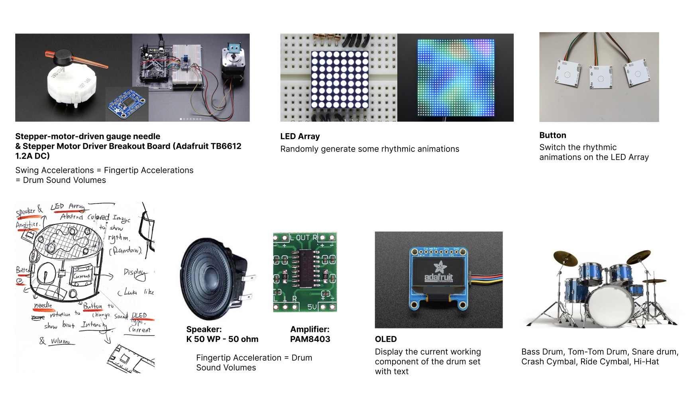
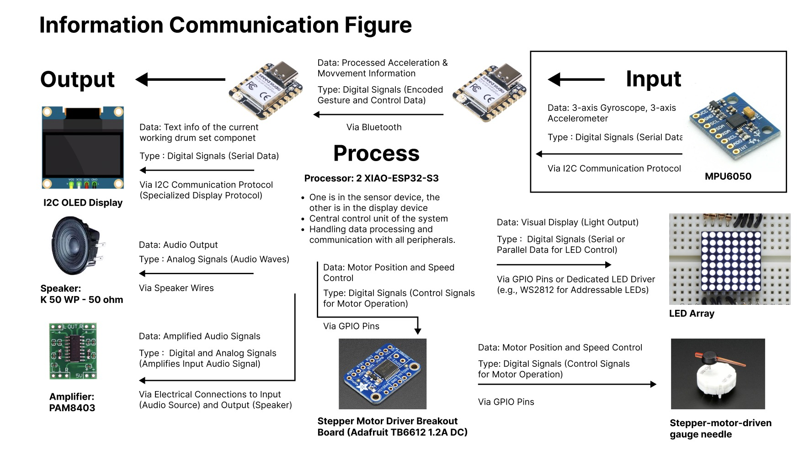

# TECHIN-514-FinalProject
This GitHub repository is for my TECHIN-514 final project and all my related files will be uploaded and updated to it.

## System Architecture with Diagram
### Slide 1 - Introduction
**Project Title**  
Finger Drumbeat

**Explanation**  
This is an IoT device set to add drum beats using hand gestures, allowing users to engage in existing music.

Generally, I want to achieve:
1. Different **fingertip accelerations** produce different **Stepper-motor-driven gauge needle** swing accelerations and different drum beat loudnesses (with **Speaker & Amplifier**).
2. Different **components of the drum** (Bass Drum, Tom-Tom Drum, Snare drum, Crash Cymbal, Ride Cymbal, Hi-Hat) are played under different **gestures**.
3. **OLED** screen displays the component currently being played.
4. **LED Array** randomly displays rhythm animation
5. **Button** can switch the random animations on the LED Array

**General Sketch**  

### Slide 2 - Sensor Device
In this part, the enclosure is divided into two parts: fingertip and wrist. The fingertip enclosure contains the MPU6050, and the wrist enclosure contains the ESP32 processor and battery.

MPU6050 and ESP32 will detect and analyze diffeerent fingertip accelerations for different needle swing accelerations and drumbeat volumes.

MPU6050 and ESP32 will also detect and analyze different gestures as different drum components (such as ass Drum, Tom-Tom Drum, Snare drum, Crash Cymbal, Ride Cymbal, Hi-Hat).

1. Sensor: MPU6050 accelerometer and gyroscope to detect hand accelerations and gestures
2. Processor: XIAO-ESP32-S3
3. Wireless link:  XIAO-ESP32-S3 has a bluetooth module inside
4. Power: Lithium Ion Polymer Battery Ideal For Feathers
5. Enclosure:(Shown on Sketch) 
6. Custom PCB: will be based on the sensor, battery & enclosure size

### Slide 3 - Display Device
The shaking acceleration of the stepper motor pointer depends on the acceleration of the finger; the intensity of the sound and enhanced sound also depends on the acceleration of the finger.

The LED array will randomly play flowing animations to reflect the linkage of audio and vision; touch the button to switch animations.

The OLED screen will display the names of the components of the drum set selected under the current gesture.

1. Stepper-motor-driven gauge needle:  Show the intensity and volume of the drumming. More forceful gestures could push the needle further, indicating a higher intensity and volume.
2. Processor: XIAO-ESP32-S3
3. LED Array:  LED Array randomly displays rhythm animation
4. Button: Capacitive touch button to switch animations
5. Enclosure:(Shown on Sketch) 
6. Custom PCB: will be based on the sensors & enclosure size
7. Battery: Lithium Ion Polymer Battery Ideal For Feathers
8. Displays: OLED - Text info of the type of drum sound currently selected

### Slide 4 - Figure & Diagram

**Device Communication Figure**

**Workflow Diagram**
